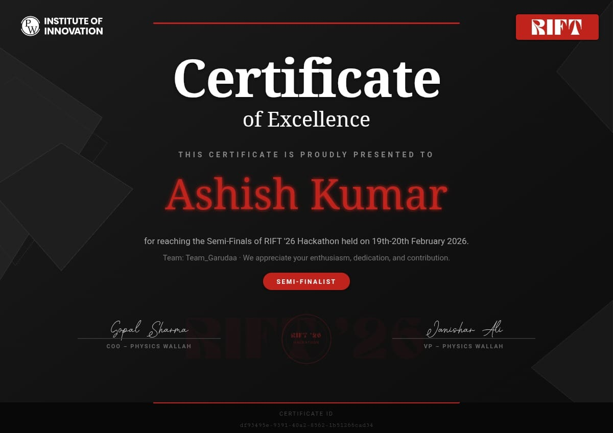
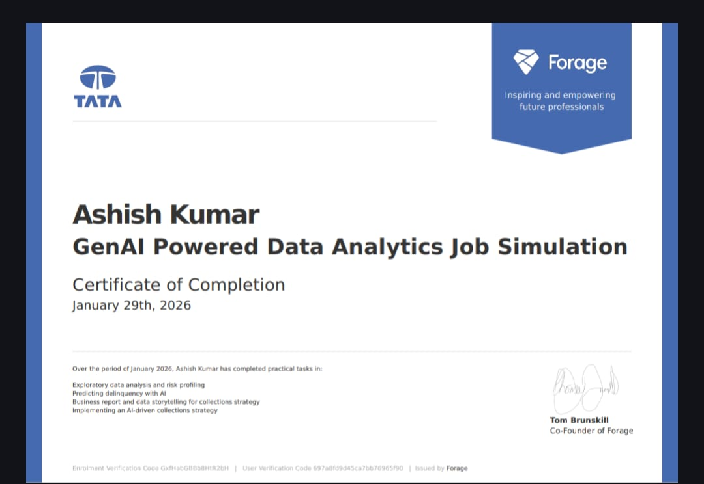
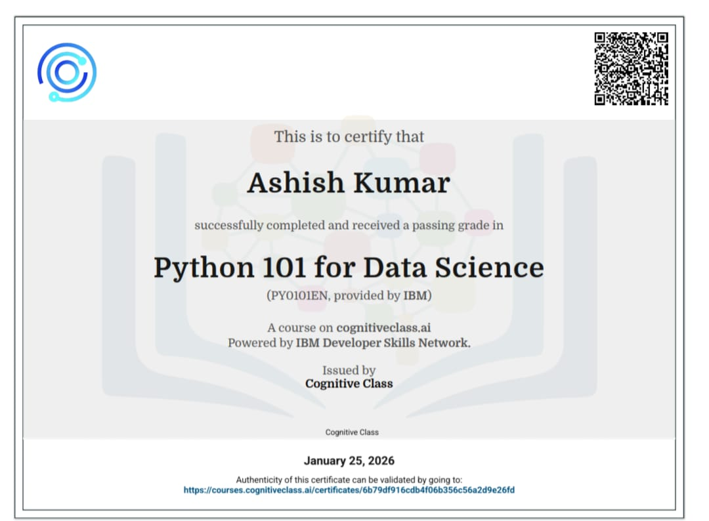

# 💫 About Me:
I’m a machine learning and deep learning enthusiast focused on building data-driven solutions and intelligent systems. I enjoy working with models that turn complex data into meaningful insights and real-world impact. Linkedln_profile - https://www.linkedin.com/in/ashish-yadav-a31454342 leetcode_profile - https://leetcode.com/u/hRPMXY2r81/

## 🌐 Socials:
  

# 💻 Tech Stack:
                   
# 📊 GitHub Stats:
 
 

## 🏆 Certifications :

### ✍️ Random Dev Quote

### 🔝 Top Contributed Repo

---

<!-- Proudly created with GPRM ( https://gprm.itsvg.in ) -->
